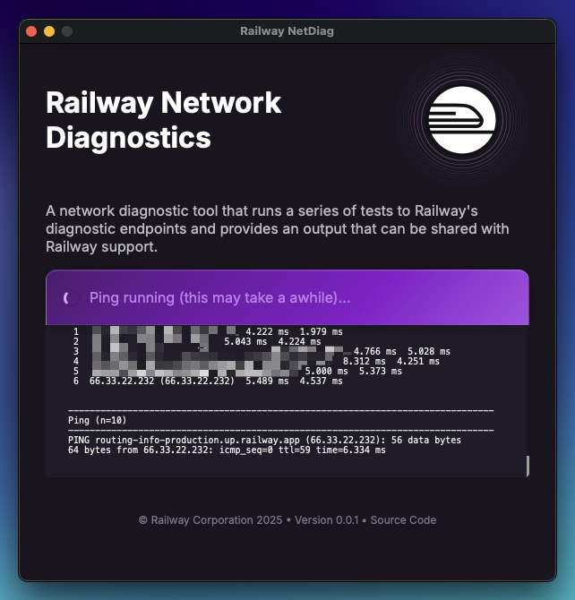

# Railway NetDiag

macOS & Windows application for diagnosing client networking issues to Railway.



## Usage

[**Download for macOS**](https://github.com/railwayapp/netdiag/releases/latest/download/RailwayNetDiag_macOS.zip) | [**Download for Windows**](https://github.com/railwayapp/netdiag/releases/latest/download/RailwayNetDiag_Win.zip)

Refer to [documentation](https://docs.railway.com/reference/network-diagnostics).

## Development

This is a [Wails](https://wails.io) + React application. To get started:

1. Clone the repository
2. Install [Wails](https://wails.io/docs/gettingstarted/installation) on your system
3. Run `wails dev` to start the application in development mode

### Structure

```
core/     - Go backend code
frontend/ - React frontend code
main.go   - Main entry point for the application
```

### Building

Use `wails build` to create a production build of the application:

```
wails build -clean -platform=windows/amd64     # Windows
wails build -clean -platform=darwin/universal  # macOS
```

This should only be necessary when testing in local dev. For production
releases, create a new release on GitHub and the build+release will be
performed automatically.

## License

[MIT Copyright (c) 2025 Railway Corporation](./LICENSE)
